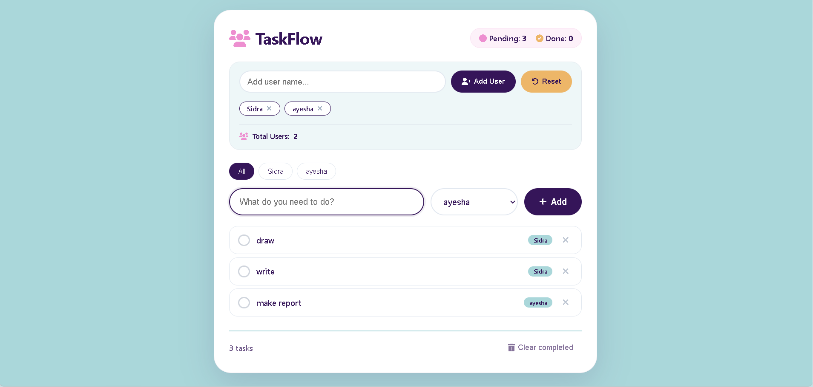

# TaskFlow · Multi-User To-Do App ✅

A beautiful, multi-user task management application with local storage persistence.

## ✨ Features

- 👥 **Multi-User Support** - Add and manage multiple users
- ✅ **Task Management** - Create, complete, and delete tasks
- 🎯 **Filter by User** - View tasks for specific users
- 📊 **Pending First Sorting** - Uncompleted tasks appear on top
- 💾 **Local Storage** - Data persists after page refresh
- 🔒 **Input Validation** - Strict validation for names and tasks
- 🎨 **Beautiful UI** - Bright Bubblegum color scheme
- 📱 **Responsive** - Works on all devices

## 🎨 Color Palette

| Color | Hex | Usage |
|-------|-----|-------|
| Bright Bubblegum Pink | `#ED8FD0` | Icons, checkboxes, hover states |
| Deep Royal Purple | `#351559` | Headings, text, primary buttons |
| Soft Pastel Cyan | `#AAD7DA` | Background, scrollbar |
| Warm Ochre Yellow | `#EDB668` | Secondary buttons, completed icon |

## 🚀 Live Demo

[View Live Demo](https://sidraliaqat.github.io/multi-user-to-do)

## 🛠️ Technologies Used

- HTML5
- CSS3
- Vanilla JavaScript
- Font Awesome Icons
- LocalStorage API

